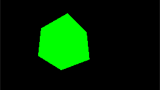
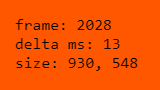

# three_start

[web page](https://detmarp.github.io/three_start)
&nbsp; | &nbsp;
[repo](https://github.com/detmarp/three_start)
&nbsp; | &nbsp;
[detmarp.github.io](https://detmarp.github.io)

## About
This repo is all about writing some simple, single-page, [`three.js`](https://threejs.org/) samples.

[Three.js](https://threejs.org/)
[[github](https://github.com/mrdoob/three.js)]
[[wikipedia](https://en.wikipedia.org/wiki/Three.js)]
is a JavaScript API that builds on WebGL, and adds a lot of support to that lower-level library.

My motivation is that I want to experiment with some 3D ideas, and for simplicity and portability reasons, I choose WebGL and three.js.

This repo, three_start, has a bunch of little demo starter sample pages.  A realistic three.js-based project would be built with multiple files.  But these demos are meant to work as stand-alone html files.

## Demo scripts
If you're viewing this as a web page, then the demo links below should run the demos.

To view the demo sources, [re-open this page as repo source](https://github.com/detmarp/three_start), and then follow the demo links.

[00-ice-breaker](./00-ice-breaker.html)

[01-resizable](./01-resizable.html)

[02-no-3d](./02-no-3d.html)

[03-lights](./03-lights.html)

[04-camera](./04-camera.html)

## Blog

[Here's a blog](blog/readme.md) of my notes as I go.  There's not really anything there yet.
